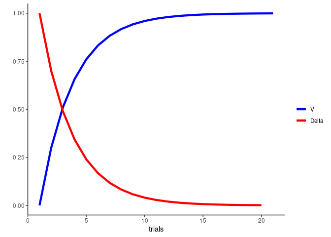
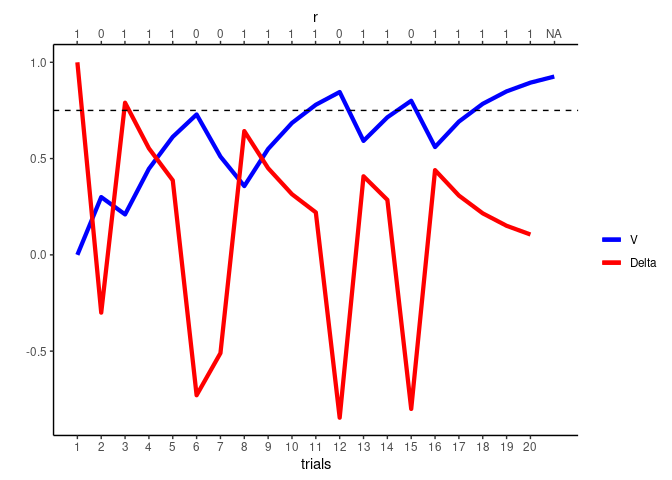
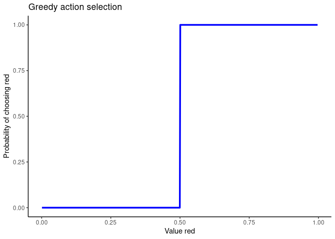
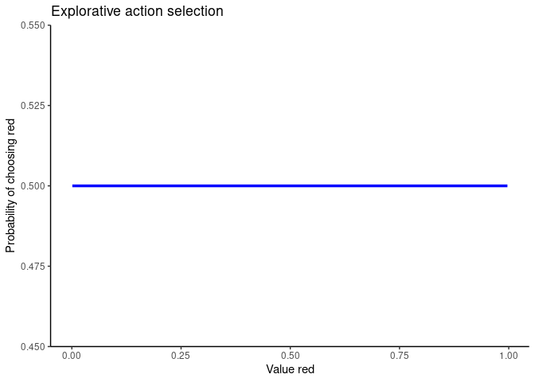
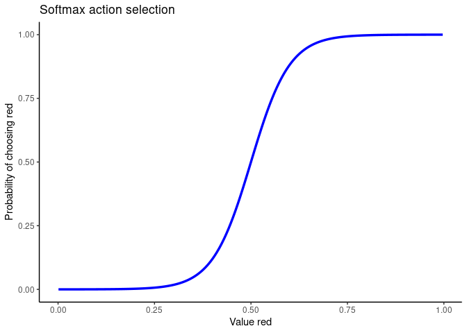
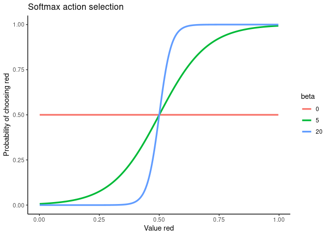
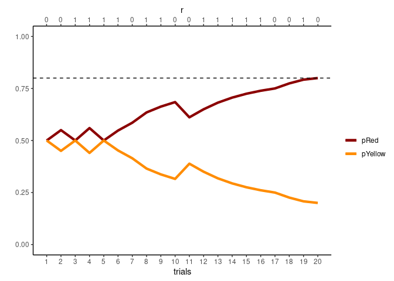

-   [Reinforcement Learning](#reinforcement-learning)
    -   [Pavlovian Learning](#pavlovian-learning)
    -   [Instrumental Learning](#instrumental-learning)
        -   [Action selection](#action-selection)
        -   [Simulate](#simulate)

call the packages and source the functions needed

``` r
library(ggplot2);theme_set(theme_classic())
source("simulation_functions/simulate_RW_pav.R")
```

# Reinforcement Learning

## Pavlovian Learning

Simulate it!

``` r
# create a vector of reinforcements
r<-rep(1, 20)

alpha<-0.3

pav_sim<-simulate_RW_pav(r, alpha)

# plot it 
ggplot(pav_sim, aes(x = t))+
  geom_line(aes(y=V, color = "V"), size = 1.5 )+
  geom_line(aes(y=Delta, color = "Delta"), size = 1.5)+
  xlab("trials")+
  ylab("")+
  scale_color_manual(
  name = "",
      values = c("V" = "blue", "Delta" = "red"))
```



Check how it changes depending on the alpha
[here](https://francescopupillo.shinyapps.io/rmw_shiny/)

Now try a probabilistic reinforcement

``` r
# sample R to be correct 75 % of the times
set.seed(1236)
p<- 0.75
nTrials<-20

r<-sample(c(1, 0), nTrials, prob = c(p, 1-p), replace = T)
mean(r)
```

    ## [1] 0.75

``` r
alpha<-0.3

pav_sim2<-simulate_RW_pav(r, alpha)

# plot it 
ggplot(pav_sim2, aes(x = t))+
  geom_line(aes(y=V, color = "V"), size = 1.5 )+
  geom_line(aes(y=Delta, color = "Delta"), size = 1.5)+
  xlab("trials")+
  ylab("")+
  #geom_text(data = data.frame(br =r), aes(x = br, label = br, y = 7.75),
    #        size = 4, col = 'grey30') +
  scale_x_continuous(breaks = seq(1:nTrials),
   sec.axis = sec_axis(name = "r",~. ,breaks = pav_sim2$t, labels =pav_sim2$r))+
    scale_color_manual(
      name = "",
      values = c("V" = "blue", "Delta" = "red"))+
     geom_hline(yintercept=p, linetype="dashed")
```



Repeat the simulation, but try to change the alpha

## Instrumental Learning

### Action selection

Greedy

``` r
source("helper_functions/greedy.R")

set.seed(12345)

# create a dataset with the two Qs
nTrials<-1000
greedy_armed<-data.frame("Qred" = numeric(length=nTrials), "Qyellow" = numeric(length=nTrials), "pRed" = numeric(length=nTrials), "pYellow" = numeric(length=nTrials))

# generate random numbers
for (n in 1:nrow(greedy_armed)){
   greedy_armed[n, "Qred"]<-runif(1, min = 0, max = 1)
   greedy_armed[n, "Qyellow"]<-1- greedy_armed[n, "Qred"]
  }


for ( n in 1:nrow(greedy_armed) ){
  cp <-greedy(greedy_armed[n, c("Qred", "Qyellow")])
   greedy_armed[n, c("pRed", "pYyellow")]<-cp
}

ggplot(greedy_armed, aes(x = Qred, y = pRed))+
  geom_line( color = "blue", size = 1.2)+
  ggtitle("Greedy action selection")+
  xlab("Value red")+
  ylab("Probability of choosing red")
```


Explorative

``` r
source("helper_functions/explorative.R")
exp_armed<-greedy_armed

# create the choice probabilities according to explorative rule
for ( n in 1:nrow(exp_armed) ){
  cp <-explorative(exp_armed[n, c("Qred", "Qyellow")])
   exp_armed[n, c("pRed", "pYellow")]<-cp
}


ggplot(exp_armed, aes(x = Qred, y = pRed))+
  geom_line( color = "blue", size = 1.2)+
  ggtitle("Explorative action selection")+
  xlab("Value red")+
  ylab("Probability of choosing red")
```



Softmax

``` r
source("helper_functions/softmax.R")

# create a new dataset by initializing it as the previous one
soft_armed<-exp_armed

# choose an inverse temperature parameter
beta<-10
for ( n in 1:nrow(soft_armed) ){
  cp <-softmax(soft_armed[n, c("Qred", "Qyellow")], beta = beta)
  soft_armed[n, c("pRed", "pYellow")]<-cp
}


ggplot(soft_armed, aes(x = Qred, y = pRed))+
  geom_line( color = "blue", size = 1.2)+
  ggtitle("Softmax action selection")+
  xlab("Value red")+
  ylab("Probability of choosing red")
```


Do it for diffeerent values

``` r
betas<-c(0, 5, 20)

# initialize dataset
all_soft<-vector()

# loop through different betas
for (b in 1:length(betas)){
  
  # loop through the dataset
  for ( n in 1:nrow(soft_armed) ){
  cp <-softmax(soft_armed[n, c("Qred", "Qyellow")], beta = betas[b])
  soft_armed[n, c("pRed", "pYellow")]<-cp
  }
  
  # create the beta in the dataframe
  soft_armed$beta<-betas[b]
  
  # append to the general dataframe
  all_soft<-rbind(all_soft, soft_armed)
}
    
# make beta a factor
all_soft$beta<-as.factor(all_soft$beta)

# now plot
ggplot(all_soft, aes(x = Qred, y = pRed, color = beta, group = beta))+
  geom_line(size = 1.2)+
  ggtitle("Softmax action selection")+
  xlab("Value red")+
  ylab("Probability of choosing red")
```



### Simulate

``` r
set.seed(12345)
source("helper_functions/chooseBinomial.R")
source("simulation_functions/simulate_RW_instr.R")

# define parameters
nTrials<-20
p_red<-0.80 # probability of red slot to be the winner
alpha<-0.20
beta<-2

# first create a data structure
sim_instr<-data.frame("t" = 1:nTrials)
                    
sim_instr$win <- sample(c("red", "yellow"), size = nTrials, prob = c(p_red, 1-p_red),
                        replace =T)
                      
# now simulate the agent
agent<-simulate_RW_instr(df = sim_instr, alpha = alpha, beta = beta)


# plot the choice probabilities
# plot it 
ggplot(agent, aes(x = t))+
  geom_line(aes(y=pred, color = "pRed"), size = 1.5 )+
  geom_line(aes(y=pyellow, color = "pYellow"), size = 1.5 )+
  #geom_line(aes(y=Delta, color = "Delta"), size = 1.5)+
  xlab("trials")+
  ylab("")+
  #geom_text(data = data.frame(br =r), aes(x = br, label = br, y = 7.75),
    #        size = 4, col = 'grey30') +
  scale_x_continuous(breaks = seq(1:nTrials),
   sec.axis = sec_axis(name = "r",~. ,breaks = agent$t, labels =agent$r))+
    scale_color_manual(
      name = "",
      values = c("pRed" = "darkred","pYellow" = "darkorange" ))+
   geom_hline(yintercept=p_red, linetype="dashed")+
  ylim(0,1)
```

    ## Warning: Removed 1 row(s) containing missing values (geom_path).

    ## Warning: Removed 1 row(s) containing missing values (geom_path).


Check the [following
link](https://francescopupillo.shinyapps.io/lr_shiny/)
